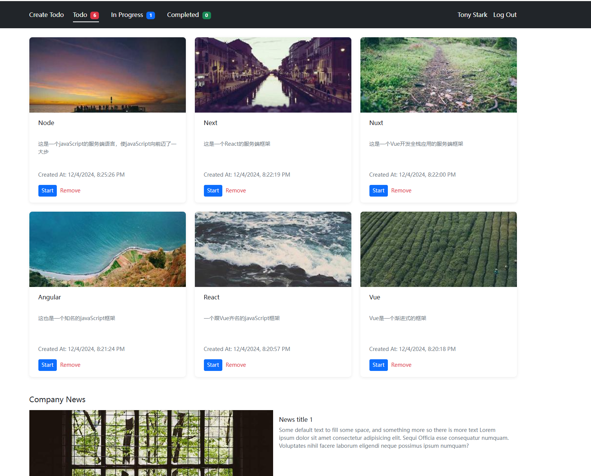

# Vue Todo List

一个使用 Vue 3 + Pinia + Bootstrap 5.2 构建的待办事项应用。支持任务的创建、状态管理和删除，以及无限滚动加载等特性。

## 🌟 效果展示



## 🌟 特性

- ✨ 创建、更新、删除和查看待办事项
- 📱 响应式设计，支持移动端和桌面端
- 🔄 任务状态管理（Todo -> In Progress -> Completed）
- ♾️ 无限滚动加载
- 🖼️ 任务卡片图片懒加载
- 💾 本地数据持久化
- ⌨️ 支持键盘导航
- 🎨 美观的 UI 设计

## 🛠️ 技术栈

- Vue 3
- Pinia (状态管理)
- Bootstrap 5.2 (UI 框架)
- Vite (构建工具)
- GitHub Pages (部署)

## 🚀 在线演示

访问 [Vue Todo List](https://wangliang01.github.io/vue-todo-list/) 查看在线演示。

## 📦 本地开发

1. 克隆项目

```bash
git clone https://github.com/wangliang01/vue-todo-list.git
cd vue-todo-list
```

2. 安装依赖

```bash
pnpm install
```

3. 生成 mock 数据

```bash
pnpm generate-mock
```

4. 启动开发服务器

```bash
pnpm dev
```
